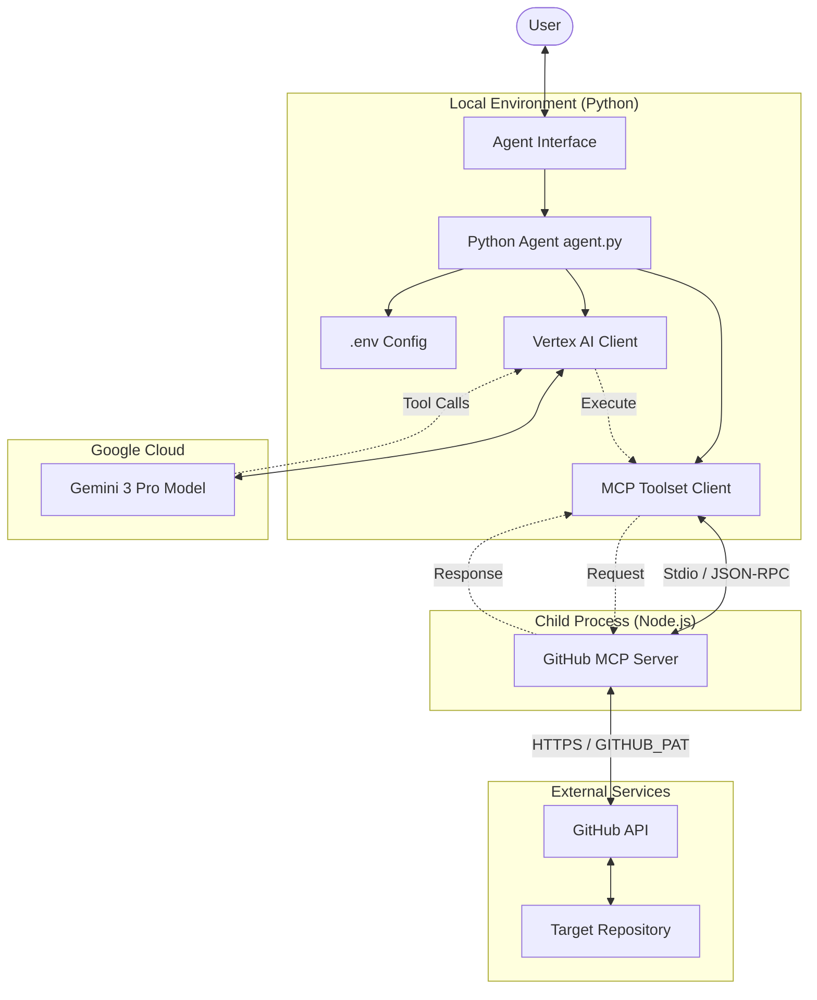

# Code Analyst Agent Architecture

This document outlines the high-level architecture of the Code Analyst Agent, explaining how its components interact to enable intelligent code analysis on GitHub repositories.

## 🏗️ High-Level Overview

The Code Analyst Agent is a Python-based application that acts as an orchestration layer between the user, a powerful LLM (Gemini 3 Pro), and GitHub repositories. It utilizes the **Model Context Protocol (MCP)** to standardize the connection between the AI model and the GitHub data source.

### Core Philosophy
The architecture follows a **"Tool-Use" pattern**. The agent itself is stateless and relies on the LLM to decide when to call tools. The MCP server provides the actual capabilities (search, read, list) which the agent invokes based on its system instructions.

## 🧩 Key Components

### 1. The Agent (`agent.py`)
*   **Role**: The central controller and entry point.
*   **Responsibilities**:
    *   Loads configuration and environment variables.
    *   Initializes the connection to Vertex AI.
    *   Configures the MCP Toolset.
    *   Defines the `root_agent` with specific system instructions ("Search-Verify-Read" loop).
*   **Key Libraries**: `google.adk`, `vertexai`.

### 2. Gemini 3 Pro (The Brain)
*   **Role**: The reasoning engine.
*   **Responsibilities**:
    *   Parses user queries (e.g., "Find the logic for X").
    *   Decides which tools to call within the MCP ecosystem.
    *   Synthesizes information returned by tools into a coherent answer.
    *   Follows the strict "SQL Logic Analyst" persona defined in the system instructions.

### 3. MCP Toolset & Client
*   **Role**: The bridge between the Python Agent and the MCP Server.
*   **Responsibilities**:
    *   Manages the lifecycle of the MCP server process.
    *   Establishes a communication channel (Stdio) with the server.
    *   Exposes the server's capabilities as function calls to the LLM.

### 4. GitHub MCP Server (`@modelcontextprotocol/server-github`)
*   **Role**: The tool provider.
*   **Implementation**: A Node.js application running as a subprocess.
*   **Responsibilities**:
    *   Executes actual GitHub API calls (Search, Get File Content).
    *   Handles authentication using the Personal Access Token (PAT).
    *   Abstracts the GitHub REST/GraphQL API into standardized MCP tools.

## 🔄 System Architecture Diagram

## 🔌 Data Flow Execution Path

1.  **Initialization**:
    *   The Python script starts and spawns the GitHub MCP server as a subprocess using `npx`.
    *   Stdio pipes are established for communication.

2.  **User Query**:
    *   User asks: *"How is revenue calculated in project X?"*

3.  **Reasoning & Tool Selection**:
    *   Gemini analyzes the request and the `search_code` tool definition.
    *   Gemini generates a tool call request: `search_code(query="revenue", owner="...", repo="...")`.

4.  **Tool Execution**:
    *   The Agent intercepts the tool call and routes it via the MCP Client.
    *   The MCP Client sends a JSON-RPC message to the Node.js MCP Server.
    *   The MCP Server calls the GitHub API and returns the results (list of files).

5.  **Recursive Analysis** ("Search-Verify-Read"):
    *   Gemini receives the search results.
    *   It decides to read specific file contents using `get_file_contents`.
    *   The cycle repeats until Gemini has enough information to answer the user.

6.  **Final Response**:
    *   Gemini synthesizes the code snippets and logic into a final answer for the user.
